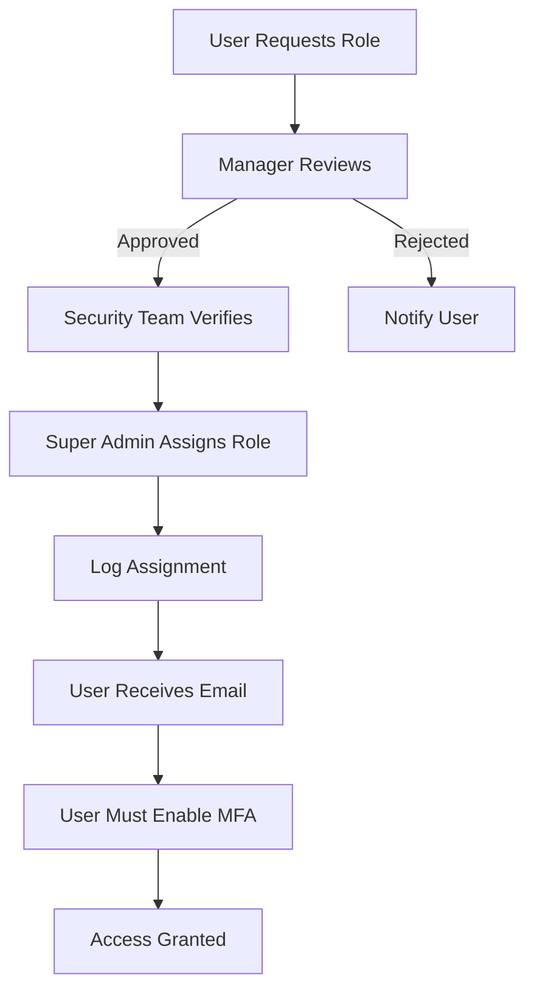

# ControlHub - Roles & Permissions

**Version**: 0.1.0  
**Last Updated**: January 23, 2026

---

## 🎯 Overview

ControlHub uses **Firebase Custom Claims** for role-based access control. Roles are stored in each user's authentication token and enforced by Firestore security rules.

**Key Principle**: Roles are internal-only. ControlHub is NOT for end users.

---

## 👥 User Roles

### 1. Super Admin (`controlhub_super_admin`)

**Description**: Full platform oversight and control

**Responsibilities**:
- Monitor all apps and systems
- View and manage alerts
- Access audit logs
- Configure app settings
- Manage ControlHub users and roles

**Permissions**:
- ✅ Read/Write app health status
- ✅ Read authentication events
- ✅ Read audit logs
- ✅ Read/Write alerts (acknowledge, resolve)
- ✅ Read support metrics
- ✅ Manage app configuration
- ✅ Assign roles to other users

**Who Gets This Role**:
- Platform Engineering Lead
- CTO
- Senior Platform Admins (max 2-3 people)

---

### 2. Security Team (`controlhub_security`)

**Description**: Security oversight and incident response

**Responsibilities**:
- Monitor authentication events
- Respond to security alerts
- Review audit logs for compliance
- Flag suspicious activity

**Permissions**:
- ✅ Read authentication events
- ✅ Read audit logs
- ✅ Read/Write alerts (security-related)
- ❌ Cannot modify app health or support metrics
- ❌ Cannot manage users or app configuration

**Who Gets This Role**:
- Security Engineers
- Compliance Officers
- SOC (Security Operations Center) team members

---

### 3. Support Team (`controlhub_support`)

**Description**: Support operations visibility

**Responsibilities**:
- Monitor support ticket metrics
- View support SLA compliance
- Access audit logs for support investigations

**Permissions**:
- ✅ Read support metrics
- ✅ Read audit logs (limited to support-related actions)
- ❌ Cannot view authentication events
- ❌ Cannot view or modify alerts
- ❌ Cannot access app health data

**Who Gets This Role**:
- Support Team Leads
- Customer Success Managers
- Support Operations Analysts

---

### 4. Auditor (`controlhub_auditor`)

**Description**: Read-only audit log access

**Responsibilities**:
- Review audit logs for compliance
- Generate compliance reports
- Investigate historical actions

**Permissions**:
- ✅ Read audit logs ONLY
- ❌ Cannot modify anything
- ❌ Cannot view real-time events
- ❌ Cannot access support or health data

**Who Gets This Role**:
- External Auditors
- Compliance Consultants
- Legal Team (during investigations)

---

## 📋 Permission Matrix

| Resource | Super Admin | Security Team | Support Team | Auditor |
|----------|-------------|---------------|--------------|---------|
| **App Health Status** | ✅ Read/Write | ❌ | ❌ | ❌ |
| **Auth Events** | ✅ Read | ✅ Read | ❌ | ❌ |
| **Audit Logs** | ✅ Read | ✅ Read | ✅ Read | ✅ Read |
| **Alerts** | ✅ Read/Write | ✅ Read/Write | ❌ | ❌ |
| **Support Metrics** | ✅ Read | ❌ | ✅ Read | ❌ |
| **App Configuration** | ✅ Read/Write | ❌ | ❌ | ❌ |
| **User Management** | ✅ Read/Write | ❌ | ❌ | ❌ |

---

## 🔐 Firestore Security Rules

### Custom Claims Structure

```javascript
// Firebase Auth Custom Claims
{
  "uid": "user_123",
  "email": "admin@alliedimpact.com",
  "customClaims": {
    "controlhub_super_admin": true
  }
}
```

### Role Validation Functions

```javascript
// firestore.rules
function isAuthenticated() {
  return request.auth != null;
}

function isSuperAdmin() {
  return isAuthenticated() && 
         ('controlhub_super_admin' in request.auth.token) && 
         request.auth.token.controlhub_super_admin == true;
}

function isSecurityTeam() {
  return isAuthenticated() && 
         ('controlhub_security' in request.auth.token) && 
         request.auth.token.controlhub_security == true;
}

function isSupportTeam() {
  return isAuthenticated() && 
         ('controlhub_support' in request.auth.token) && 
         request.auth.token.controlhub_support == true;
}

function isAuditor() {
  return isAuthenticated() && 
         ('controlhub_auditor' in request.auth.token) && 
         request.auth.token.controlhub_auditor == true;
}

function hasAnyRole() {
  return isSuperAdmin() || isSecurityTeam() || 
         isSupportTeam() || isAuditor();
}
```

### Collection-Level Rules

```javascript
// App Health (Super Admin only)
match /controlhub_app_health/{appId} {
  allow read: if isSuperAdmin();
  allow write: if false; // API only
}

// Auth Events (Super Admin + Security)
match /controlhub_auth_events/{eventId} {
  allow read: if isSuperAdmin() || isSecurityTeam();
  allow write: if false; // API only
}

// Audit Logs (All authenticated, IMMUTABLE)
match /controlhub_audit_logs/{logId} {
  allow read: if hasAnyRole();
  allow create: if false; // API only
  allow update, delete: if false; // NEVER
}

// Alerts (Super Admin + Security can acknowledge/resolve)
match /controlhub_alerts/{alertId} {
  allow read: if isSuperAdmin() || isSecurityTeam();
  allow update: if isSuperAdmin() || isSecurityTeam();
  allow create, delete: if false; // API only
}

// Support Metrics (Super Admin + Support)
match /controlhub_support_metrics/{appId} {
  allow read: if isSuperAdmin() || isSupportTeam();
  allow write: if false; // API only
}
```

---

## 🔑 Role Assignment

### Firebase Admin SDK (Node.js)

```typescript
import * as admin from 'firebase-admin';

// Assign Super Admin role
async function assignSuperAdmin(email: string) {
  const user = await admin.auth().getUserByEmail(email);
  
  await admin.auth().setCustomUserClaims(user.uid, {
    controlhub_super_admin: true
  });
  
  console.log(`✅ Assigned Super Admin role to ${email}`);
}

// Assign Security Team role
async function assignSecurityRole(email: string) {
  const user = await admin.auth().getUserByEmail(email);
  
  await admin.auth().setCustomUserClaims(user.uid, {
    controlhub_security: true
  });
  
  console.log(`✅ Assigned Security Team role to ${email}`);
}

// Remove all roles
async function removeAllRoles(email: string) {
  const user = await admin.auth().getUserByEmail(email);
  
  await admin.auth().setCustomUserClaims(user.uid, null);
  
  console.log(`✅ Removed all roles from ${email}`);
}
```

### CLI Script

```bash
# Set Super Admin
node scripts/set-role.js admin@alliedimpact.com super_admin

# Set Security Team
node scripts/set-role.js security@alliedimpact.com security

# Set Support Team
node scripts/set-role.js support@alliedimpact.com support

# Set Auditor
node scripts/set-role.js auditor@example.com auditor

# Remove role
node scripts/set-role.js user@example.com none
```

---

## 🛡️ Security Best Practices

### 1. Principle of Least Privilege
- Assign minimum required role
- Review roles quarterly
- Remove roles when no longer needed

### 2. MFA Mandatory
- **ALL** ControlHub users MUST enable MFA
- Enforced at Firebase Auth level
- No exceptions

### 3. Role Justification
- Document WHY each user has their role
- Maintain role assignment log in audit system
- Require manager approval for role changes

### 4. Audit Log Immutability
- Audit logs can NEVER be modified or deleted
- Enforced by Firestore rules
- 7-year retention for compliance

### 5. IP Whitelisting (Optional)
- Consider restricting ControlHub access to office IPs
- Implemented via Firebase App Check or Cloud Armor

---

## 📊 Role Assignment Log

Maintain a record of all role assignments:

```typescript
// controlhub_role_assignments collection
{
  userId: 'user_123',
  email: 'admin@alliedimpact.com',
  role: 'controlhub_super_admin',
  assignedBy: 'cto@alliedimpact.com',
  assignedAt: '2026-01-23T10:00:00Z',
  justification: 'Platform Engineering Lead',
  approvedBy: 'ceo@alliedimpact.com',
  revokedAt: null
}
```

---

## 🚨 Role Escalation Process

### Temporary Super Admin Access

1. **Request**: Submit ticket with justification
2. **Approval**: Requires CEO or CTO approval
3. **Assignment**: Automated via Cloud Function
4. **Duration**: Max 48 hours
5. **Revocation**: Automatic after expiration
6. **Audit**: All actions logged

---

## 📝 Role Change Workflow



---

## 🔄 Role Review Schedule

| Review Type | Frequency | Owner |
|-------------|-----------|-------|
| **Active Roles** | Quarterly | Security Team |
| **Super Admins** | Monthly | CTO |
| **External Auditors** | Per engagement | Legal Team |
| **Inactive Users** | Weekly (auto) | System |

---

## 📞 Role Management Support

**Questions about roles?**
- Security Team: security@alliedimpact.com
- Platform Team: platform@alliedimpact.com

**Emergency role revocation:**
- CTO (24/7): +27 XX XXX XXXX
- Security Lead (24/7): +27 XX XXX XXXX

---

**Last Updated**: January 23, 2026  
**Maintained By**: Security Team + Platform Engineering
